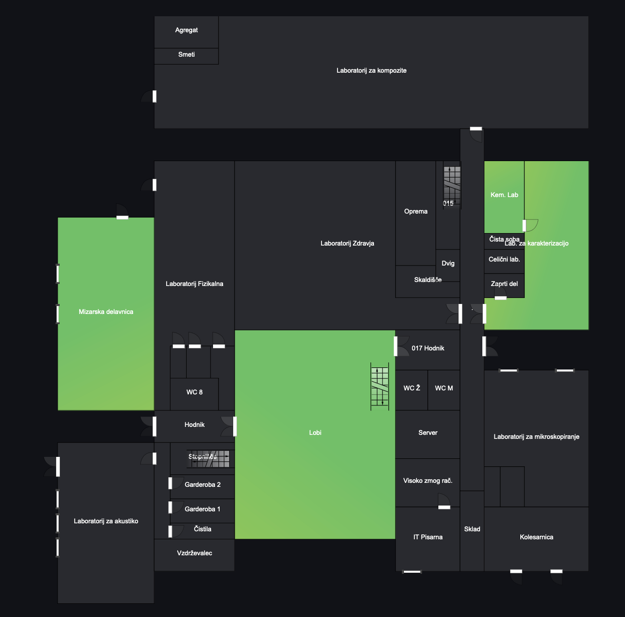

# Floor Plan Indoor Air Quality monitoring
<p style="text-align:center; opacity: 0.5">(soon interactive)</p>



### Features
- [x] Air Quality rendering
- [x] Easy configuration and setup
- [ ] Interactive rooms
- [ ] Detailed charts of IAQ history.

### Short description
Monitoring indoor air quality through floor plan visualization in Grafana using Flux query language allows for gaining valuable insights into the air quality of different areas within a building. 
By integrating sensors and data collection points throughout the building, Grafana can display real-time and historical air quality data on a floor plan layout. 
This enables users to easily identify areas with poor air quality and take appropriate actions to improve it, such as adjusting ventilation systems or implementing air purifiers. Overall, this approach enhances indoor air quality management and contributes to creating healthier and more comfortable environments for occupants.

### Flux Query Example
```flux
site_results = from(bucket: "iaq")
  |> range(start: v.timeRangeStart, stop: v.timeRangeStop)
  |> filter(fn: (r) => r["_measurement"] == "iaq_data")
  |> filter(fn: (r) => r["building"] == "innorenew")

sensor_ids = site_results 
  |> map(fn: (r) => ({r with _value: string(v:r._value)}))
  |> keep(columns: ["_time", "_value", "_field", "sensor_id"])

mapped_sensors = sensor_ids
  |> truncateTimeColumn(unit: 1m)
  |> pivot(rowKey: ["_time", "_field"], columnKey: ["sensor_id"], valueColumn: "_value")
  |> group(columns: ["_time"])

mapped_sensors
```

#### Settings
Room JSON sample:
```json
{"rooms":[{"lines":[{"start":{"x":-28,"y":5},"end":{"x":-40,"y":5}},{"start":{"x":-40,"y":5},"end":{"x":-40,"y":-15}},{"start":{"x":-40,"y":-15},"end":{"x":-28,"y":-15}},{"start":{"x":-28,"y":-15},"end":{"x":-28,"y":5}}],"quality":0,"position":{"x":-34,"y":-5},"rotation":0,"type":"Room","name":"Laboratorij za akustiko"},{"lines":[{"start":{"x":-28,"y":5},"end":{"x":-26,"y":5}},{"start":{"x":-26,"y":5},"end":{"x":-26,"y":-7}},{"start":{"x":-26,"y":-7},"end":{"x":-28,"y":-7}},{"start":{"x":-28,"y":-7},"end":{"x":-28,"y":5}}],"quality":0,"position":{"x":-27,"y":-1},"rotation":0,"type":"Room","name":""},{"lines":[{"start":{"x":-28,"y":-7},"end":{"x":-18,"y":-7}},{"start":{"x":-18,"y":-7},"end":{"x":-18,"y":-11}},{"start":{"x":-18,"y":-11},"end":{"x":-28,"y":-11}},{"start":{"x":-28,"y":-11},"end":{"x":-28,"y":-7}}],"quality":0,"position":{"x":-23,"y":-9},"rotation":0,"type":"Room","name":"Vzdrževalec"},{"lines":[{"start":{"x":-26,"y":-7},"end":{"x":-18,"y":-7}},{"start":{"x":-18,"y":-7},"end":{"x":-18,"y":-5}},{"start":{"x":-18,"y":-5},"end":{"x":-26,"y":-5}},{"start":{"x":-26,"y":-5},"end":{"x":-26,"y":-7}}],"quality":0,"position":{"x":-22,"y":-6},"rotation":0,"type":"Room","name":"Čistila"},{"lines":[{"start":{"x":-26,"y":5},"end":{"x":-18,"y":5}},{"start":{"x":-18,"y":5},"end":{"x":-18,"y":1}},{"start":{"x":-18,"y":1},"end":{"x":-26,"y":1}},{"start":{"x":-26,"y":1},"end":{"x":-26,"y":5}}],"quality":0,"position":{"x":-22,"y":3},"rotation":0,"type":"Room","name":"Stopnišče"},{"lines":[{"start":{"x":-26,"y":-2},"end":{"x":-18,"y":-2}},{"start":{"x":-18,"y":-2},"end":{"x":-18,"y":1}},{"start":{"x":-18,"y":1},"end":{"x":-26,"y":1}},{"start":{"x":-26,"y":1},"end":{"x":-26,"y":-2}}],"quality":0,"position":{"x":-22,"y":-0.5},"rotation":0,"type":"Room","name":"Garderoba 2"},{"lines":[{"start":{"x":-26,"y":-2},"end":{"x":-26,"y":-5}},{"start":{"x":-26,"y":-5},"end":{"x":-18,"y":-5}},{"start":{"x":-18,"y":-5},"end":{"x":-18,"y":-2}},{"start":{"x":-18,"y":-2},"end":{"x":-26,"y":-2}}],"quality":0,"position":{"x":-22,"y":-3.5},"rotation":0,"type":"Room","name":"Garderoba 1"},{"lines":[{"start":{"x":-28,"y":5},"end":{"x":-28,"y":9}},{"start":{"x":-28,"y":9},"end":{"x":-18,"y":9}},{"start":{"x":-18,"y":9},"end":{"x":-18,"y":5}},{"start":{"x":-18,"y":5},"end":{"x":-28,"y":5}}],"quality":0,"position":{"x":-23,"y":7},"rotation":0,"type":"Room","name":"Hodnik"},{"lines":[{"start":{"x":-26,"y":9},"end":{"x":-26,"y":13}},{"start":{"x":-26,"y":13},"end":{"x":-20,"y":13}},{"start":{"x":-20,"y":13},"end":{"x":-20,"y":9}},{"start":{"x":-20,"y":9},"end":{"x":-26,"y":9}}],"quality":0,"position":{"x":-23,"y":11},"rotation":0,"type":"Room","name":"WC 8"},{"lines":[{"start":{"x":-20,"y":9},"end":{"x":-18,"y":9}},{"start":{"x":-18,"y":9},"end":{"x":-18,"y":17}},{"start":{"x":-18,"y":17},"end":{"x":-21,"y":17}},{"start":{"x":-21,"y":17},"end":{"x":-21,"y":13}},{"start":{"x":-21,"y":13},"end":{"x":-20,"y":13}},{"start":{"x":-20,"y":13},"end":{"x":-20,"y":9}}],"quality":0,"position":{"x":-19.5,"y":13},"rotation":0,"type":"Room","name":""},{"lines":[{"start":{"x":-26,"y":13},"end":{"x":-26,"y":17}},{"start":{"x":-26,"y":17},"end":{"x":-24,"y":17}},{"start":{"x":-24,"y":17},"end":{"x":-24,"y":13}},{"start":{"x":-24,"y":13},"end":{"x":-26,"y":13}}],"quality":0,"position":{"x":-25,"y":15},"rotation":0,"type":"Room","name":""},{"lines":[{"start":{"x":-24,"y":13},"end":{"x":-21,"y":13}},{"start":{"x":-21,"y":13},"end":{"x":-21,"y":17}},{"start":{"x":-21,"y":17},"end":{"x":-23,"y":17}},{"start":{"x":-23,"y":17},"end":{"x":-24,"y":17}},{"start":{"x":-24,"y":17},"end":{"x":-24,"y":13}}],"quality":0,"position":{"x":-22.5,"y":15},"rotation":0,"type":"Room","name":""},{"lines":[{"start":{"x":-26,"y":9},"end":{"x":-28,"y":9}},{"start":{"x":-28,"y":9},"end":{"x":-28,"y":40}},{"start":{"x":-28,"y":40},"end":{"x":-18,"y":40}},{"start":{"x":-18,"y":40},"end":{"x":-18,"y":17}},{"start":{"x":-18,"y":17},"end":{"x":-26,"y":17}},{"start":{"x":-26,"y":17},"end":{"x":-26,"y":9}}],"quality":0,"position":{"x":-23,"y":24.5},"rotation":0,"type":"Room","name":"Laboratorij Fizikalna"},{"lines":[{"start":{"x":-28,"y":9},"end":{"x":-40,"y":9}},{"start":{"x":-40,"y":9},"end":{"x":-40,"y":33}},{"start":{"x":-40,"y":33},"end":{"x":-28,"y":33}},{"start":{"x":-28,"y":33},"end":{"x":-28,"y":9}}],"quality":0,"position":{"x":-34,"y":21},"rotation":0,"type":"Room","name":"Mizarska delavnica"},{"lines":[{"start":{"x":-18,"y":-7},"end":{"x":2,"y":-7}},{"start":{"x":2,"y":-7},"end":{"x":2,"y":19}},{"start":{"x":2,"y":19},"end":{"x":-18,"y":19}},{"start":{"x":-18,"y":19},"end":{"x":-18,"y":-7}}],"quality":0,"position":{"x":-8,"y":6},"rotation":0,"type":"Room","name":"Lobi"},{"lines":[{"start":{"x":2,"y":19},"end":{"x":10,"y":19}},{"start":{"x":10,"y":19},"end":{"x":10,"y":23}},{"start":{"x":10,"y":23},"end":{"x":2,"y":23}},{"start":{"x":2,"y":23},"end":{"x":2,"y":40}},{"start":{"x":2,"y":40},"end":{"x":-18,"y":40}},{"start":{"x":-18,"y":40},"end":{"x":-18,"y":19}},{"start":{"x":-18,"y":19},"end":{"x":2,"y":19}}],"quality":0,"position":{"x":-4,"y":29.5},"rotation":0,"type":"Room","name":"Laboratorij Zdravja"},{"lines":[{"start":{"x":2,"y":23},"end":{"x":2,"y":27}},{"start":{"x":2,"y":27},"end":{"x":7,"y":27}},{"start":{"x":7,"y":27},"end":{"x":7,"y":25}},{"start":{"x":7,"y":25},"end":{"x":10,"y":25}},{"start":{"x":10,"y":25},"end":{"x":10,"y":23}},{"start":{"x":10,"y":23},"end":{"x":2,"y":23}}],"quality":0,"position":{"x":6,"y":25},"rotation":0,"type":"Room","name":"Skaldišče"},{"lines":[{"start":{"x":7,"y":27},"end":{"x":7,"y":29}},{"start":{"x":7,"y":29},"end":{"x":10,"y":29}},{"start":{"x":10,"y":29},"end":{"x":10,"y":25}},{"start":{"x":10,"y":25},"end":{"x":7,"y":25}},{"start":{"x":7,"y":25},"end":{"x":7,"y":27}}],"quality":0,"position":{"x":8.5,"y":27},"rotation":0,"type":"Room","name":"Dvig"},{"lines":[{"start":{"x":7,"y":27},"end":{"x":7,"y":40}},{"start":{"x":7,"y":40},"end":{"x":2,"y":40}},{"start":{"x":2,"y":40},"end":{"x":2,"y":27}},{"start":{"x":2,"y":27},"end":{"x":7,"y":27}}],"quality":0,"position":{"x":4.5,"y":33.5},"rotation":0,"type":"Room","name":"Oprema"},{"lines":[{"start":{"x":10,"y":29},"end":{"x":10,"y":40}},{"start":{"x":10,"y":40},"end":{"x":7,"y":40}},{"start":{"x":7,"y":40},"end":{"x":7,"y":29}},{"start":{"x":7,"y":29},"end":{"x":10,"y":29}}],"quality":0,"position":{"x":8.5,"y":34.5},"rotation":0,"type":"Room","name":"015"},{"lines":[{"start":{"x":-28,"y":44},"end":{"x":-28,"y":52}},{"start":{"x":-28,"y":52},"end":{"x":-20,"y":52}},{"start":{"x":-20,"y":52},"end":{"x":-20,"y":58}},{"start":{"x":-20,"y":58},"end":{"x":26,"y":58}},{"start":{"x":26,"y":58},"end":{"x":26,"y":44}},{"start":{"x":26,"y":44},"end":{"x":-28,"y":44}}],"quality":0,"position":{"x":-1,"y":51},"rotation":0,"type":"Room","name":"Laboratorij za kompozite"},{"lines":[{"start":{"x":-28,"y":52},"end":{"x":-28,"y":54}},{"start":{"x":-28,"y":54},"end":{"x":-20,"y":54}},{"start":{"x":-20,"y":54},"end":{"x":-20,"y":52}},{"start":{"x":-20,"y":52},"end":{"x":-28,"y":52}}],"quality":0,"position":{"x":-24,"y":53},"rotation":0,"type":"Room","name":"Smeti"},{"lines":[{"start":{"x":-20,"y":54},"end":{"x":-28,"y":54}},{"start":{"x":-28,"y":54},"end":{"x":-28,"y":58}},{"start":{"x":-28,"y":58},"end":{"x":-20,"y":58}},{"start":{"x":-20,"y":58},"end":{"x":-20,"y":54}}],"quality":0,"position":{"x":-24,"y":56},"rotation":0,"type":"Room","name":"Agregat"},{"lines":[{"start":{"x":13,"y":40},"end":{"x":13,"y":31}},{"start":{"x":13,"y":31},"end":{"x":18,"y":31}},{"start":{"x":18,"y":31},"end":{"x":18,"y":40}},{"start":{"x":18,"y":40},"end":{"x":13,"y":40}}],"quality":0,"position":{"x":15.5,"y":35.5},"rotation":0,"type":"Room","name":"Kem. Lab"},{"lines":[{"start":{"x":13,"y":31},"end":{"x":13,"y":29}},{"start":{"x":13,"y":29},"end":{"x":18,"y":29}},{"start":{"x":18,"y":29},"end":{"x":18,"y":31}},{"start":{"x":18,"y":31},"end":{"x":13,"y":31}}],"quality":0,"position":{"x":15.5,"y":30},"rotation":0,"type":"Room","name":"Čista soba"},{"lines":[{"start":{"x":13,"y":29},"end":{"x":13,"y":26}},{"start":{"x":13,"y":26},"end":{"x":18,"y":26}},{"start":{"x":18,"y":26},"end":{"x":18,"y":29}},{"start":{"x":18,"y":29},"end":{"x":13,"y":29}}],"quality":0,"position":{"x":15.5,"y":27.5},"rotation":0,"type":"Room","name":"Celični lab."},{"lines":[{"start":{"x":13,"y":26},"end":{"x":13,"y":23}},{"start":{"x":13,"y":23},"end":{"x":18,"y":23}},{"start":{"x":18,"y":23},"end":{"x":18,"y":26}},{"start":{"x":18,"y":26},"end":{"x":13,"y":26}}],"quality":0,"position":{"x":15.5,"y":24.5},"rotation":0,"type":"Room","name":"Zaprti del"},{"lines":[{"start":{"x":13,"y":23},"end":{"x":18,"y":23}},{"start":{"x":18,"y":23},"end":{"x":18,"y":40}},{"start":{"x":18,"y":40},"end":{"x":26,"y":40}},{"start":{"x":26,"y":40},"end":{"x":26,"y":19}},{"start":{"x":26,"y":19},"end":{"x":13,"y":19}},{"start":{"x":13,"y":19},"end":{"x":13,"y":23}}],"quality":0,"position":{"x":19.5,"y":29.5},"rotation":0,"type":"Room","name":"Lab. za karakterizacijo"},{"lines":[{"start":{"x":2,"y":19},"end":{"x":2,"y":14}},{"start":{"x":2,"y":14},"end":{"x":10,"y":14}},{"start":{"x":10,"y":14},"end":{"x":10,"y":19}},{"start":{"x":10,"y":19},"end":{"x":2,"y":19}}],"quality":0,"position":{"x":6,"y":16.5},"rotation":0,"type":"Room","name":"017 Hodnik"},{"lines":[{"start":{"x":2,"y":14},"end":{"x":2,"y":9}},{"start":{"x":2,"y":9},"end":{"x":6,"y":9}},{"start":{"x":6,"y":9},"end":{"x":6,"y":14}},{"start":{"x":6,"y":14},"end":{"x":2,"y":14}}],"quality":0,"position":{"x":4,"y":11.5},"rotation":0,"type":"Room","name":"WC Ž"},{"lines":[{"start":{"x":6,"y":14},"end":{"x":6,"y":9}},{"start":{"x":6,"y":9},"end":{"x":10,"y":9}},{"start":{"x":10,"y":9},"end":{"x":10,"y":14}},{"start":{"x":10,"y":14},"end":{"x":6,"y":14}}],"quality":0,"position":{"x":8,"y":11.5},"rotation":0,"type":"Room","name":"WC M"},{"lines":[{"start":{"x":2,"y":9},"end":{"x":2,"y":3}},{"start":{"x":2,"y":3},"end":{"x":10,"y":3}},{"start":{"x":10,"y":3},"end":{"x":10,"y":9}},{"start":{"x":10,"y":9},"end":{"x":2,"y":9}}],"quality":0,"position":{"x":6,"y":6},"rotation":0,"type":"Room","name":"Server"},{"lines":[{"start":{"x":2,"y":3},"end":{"x":2,"y":-3}},{"start":{"x":2,"y":-3},"end":{"x":10,"y":-3}},{"start":{"x":10,"y":-3},"end":{"x":10,"y":3}},{"start":{"x":10,"y":3},"end":{"x":2,"y":3}}],"quality":0,"position":{"x":6,"y":0},"rotation":0,"type":"Room","name":"Visoko zmog rač."},{"lines":[{"start":{"x":2,"y":-3},"end":{"x":2,"y":-11}},{"start":{"x":2,"y":-11},"end":{"x":10,"y":-11}},{"start":{"x":10,"y":-11},"end":{"x":10,"y":-3}},{"start":{"x":10,"y":-3},"end":{"x":2,"y":-3}}],"quality":0,"position":{"x":6,"y":-7},"rotation":0,"type":"Room","name":"IT Pisarna"},{"lines":[{"start":{"x":13,"y":14},"end":{"x":26,"y":14}},{"start":{"x":26,"y":14},"end":{"x":26,"y":-3}},{"start":{"x":26,"y":-3},"end":{"x":18,"y":-3}},{"start":{"x":18,"y":-3},"end":{"x":18,"y":2}},{"start":{"x":18,"y":2},"end":{"x":13,"y":2}},{"start":{"x":13,"y":2},"end":{"x":13,"y":14}}],"quality":0,"position":{"x":19.5,"y":5.5},"rotation":0,"type":"Room","name":"Laboratorij za mikroskopiranje"},{"lines":[{"start":{"x":13,"y":2},"end":{"x":13,"y":-3}},{"start":{"x":13,"y":-3},"end":{"x":15,"y":-3}},{"start":{"x":15,"y":-3},"end":{"x":15,"y":2}},{"start":{"x":15,"y":2},"end":{"x":13,"y":2}}],"quality":0,"position":{"x":14,"y":-0.5},"rotation":0,"type":"Room","name":""},{"lines":[{"start":{"x":15,"y":-3},"end":{"x":18,"y":-3}},{"start":{"x":18,"y":-3},"end":{"x":18,"y":2}},{"start":{"x":18,"y":2},"end":{"x":15,"y":2}},{"start":{"x":15,"y":2},"end":{"x":15,"y":-3}}],"quality":0,"position":{"x":16.5,"y":-0.5},"rotation":0,"type":"Room","name":""},{"lines":[{"start":{"x":13,"y":-3},"end":{"x":13,"y":-11}},{"start":{"x":13,"y":-11},"end":{"x":26,"y":-11}},{"start":{"x":26,"y":-11},"end":{"x":26,"y":-3}},{"start":{"x":26,"y":-3},"end":{"x":13,"y":-3}}],"quality":0,"position":{"x":19.5,"y":-7},"rotation":0,"type":"Room","name":"Kolesarnica"},{"lines":[{"start":{"x":10,"y":-11},"end":{"x":13,"y":-11}},{"start":{"x":13,"y":-11},"end":{"x":13,"y":-1}},{"start":{"x":13,"y":-1},"end":{"x":10,"y":-1}},{"start":{"x":10,"y":-1},"end":{"x":10,"y":-11}}],"quality":0,"position":{"x":11.5,"y":-6},"rotation":0,"type":"Room","name":"Sklad"},{"lines":[{"start":{"x":10,"y":44},"end":{"x":10,"y":-1}},{"start":{"x":10,"y":-1},"end":{"x":13,"y":-1}},{"start":{"x":13,"y":-1},"end":{"x":13,"y":44}},{"start":{"x":13,"y":44},"end":{"x":10,"y":44}}],"quality":0,"position":{"x":11.5,"y":21.5},"rotation":0,"type":"Room","name":"."}],"objects":[{"position":{"x":-28,"y":2},"rotation":1.5,"type":"Door"},{"position":{"x":-40,"y":1},"rotation":1.5,"type":"DoubleDoor"},{"position":{"x":-39,"y":-3},"rotation":0.5,"type":"Window"},{"position":{"x":-39,"y":-6},"rotation":0.5,"type":"Window"},{"position":{"x":-39,"y":-9},"rotation":0.5,"type":"Window"},{"position":{"x":-24,"y":-7},"rotation":0.5,"type":"Door"},{"position":{"x":-24,"y":-1},"rotation":0.5,"type":"Door"},{"position":{"x":-24,"y":-4},"rotation":0.5,"type":"Door"},{"position":{"x":-20,"y":2},"rotation":0.5,"type":"Stairs"},{"position":{"x":-28,"y":6},"rotation":1.5,"type":"DoubleDoor"},{"position":{"x":-18,"y":6},"rotation":1.5,"type":"DoubleDoor"},{"position":{"x":-24,"y":17},"rotation":0,"type":"Door"},{"position":{"x":-22,"y":17},"rotation":0,"type":"Door"},{"position":{"x":-19,"y":17},"rotation":0,"type":"Door"},{"position":{"x":-31,"y":33},"rotation":0,"type":"Door"},{"position":{"x":-39,"y":25},"rotation":0.5,"type":"Window"},{"position":{"x":-39,"y":20},"rotation":0.5,"type":"Window"},{"position":{"x":-28,"y":36},"rotation":1.5,"type":"Door"},{"position":{"x":1,"y":11},"rotation":0,"type":"Stairs"},{"position":{"x":4,"y":16},"rotation":0.5,"type":"DoubleDoor"},{"position":{"x":10,"y":36},"rotation":0,"type":"Stairs"},{"position":{"x":10,"y":20},"rotation":1.5,"type":"DoubleDoor"},{"position":{"x":-28,"y":47},"rotation":1.5,"type":"Door"},{"position":{"x":9,"y":-3},"rotation":0,"type":"Door"},{"position":{"x":5,"y":-12},"rotation":0,"type":"Window"},{"position":{"x":18,"y":-13},"rotation":1,"type":"Door"},{"position":{"x":23,"y":-13},"rotation":1,"type":"Door"},{"position":{"x":17,"y":13},"rotation":0,"type":"Window"},{"position":{"x":24,"y":13},"rotation":0,"type":"Window"},{"position":{"x":15,"y":16},"rotation":0.5,"type":"DoubleDoor"},{"position":{"x":13,"y":20},"rotation":1.5,"type":"DoubleDoor"},{"position":{"x":16,"y":23},"rotation":0,"type":"Door"},{"position":{"x":20,"y":31},"rotation":0.5,"type":"Door"},{"position":{"x":13,"y":42},"rotation":1,"type":"Door"}]}
```

#### Note:
The plugin is not yet signed and is not available through the grafana store.